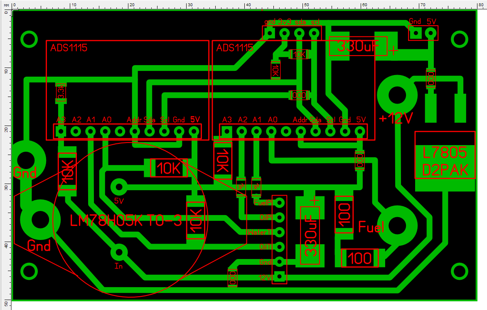
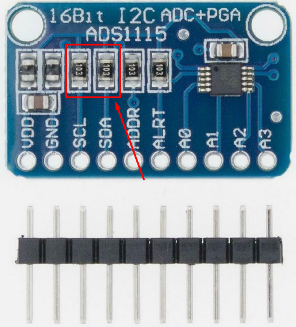

<h1 align = "center"> Dash_THMI for Civic EF</h1>

Project is for VSCode with PlatformIO. 
Arduino framework.

It displays:
- Fuel level (rom stock sensor.
- Coolant temperatue. External additional sensor required. Could be installed in stock place in case of D-series engine. Most likely should be the same for other Honda engine series.
- Oil temperature. External additional sensor required.
- Oil pressure. External additional sensor required. 150psi. 0.5-4.5v
- Fuel pressure. External additional sensor required. 100psi. 0.5-4.5v
- Onboard voltage.

All these values are splitted into 2 screens. Screens could be switched with button.

 

Sensors I used:
- Temperature - [Aliexpress](https://www.aliexpress.com/item/32841863847.html) (2 Wire Sensor, 1/8 NPT Thread, Temp Range 0°C to 150°C.)
- Pressure - [Aliexpress](https://www.aliexpress.com/item/1005002854614444.html) (3 Wire Sensor, 1/8 NPT Thread, Output signal: 0.5-4.5V)

### Lilygo T-HMI

[Lilygo T-HMI](https://www.lilygo.cc/products/t-hmi) ESP32S3 dev board with 2.8inch display is used as main unit. It fits perfectly into EF's dashboard housing just like it was designed for this.
It stands there upside down.

However, minor modifications to this board are required due to the tight fitment:
1. Solder out "left" grove connector (when looking at the display upside down)
2. Solder out all buttons
These components slightly protrude beyond the board and prevent the correct installation of the display into the housing.

### PCB

PCB for peripherals and power supply is included in PCB folder (SprintLayout 6 format). 
There is also mirrored PDF version for PCB etching using Laser Printer if you don't have SprintLayout.

It is recommended to use high precision resistor for voltage dividers. Bigger ones are SMD 2512, smaller are SMD1206.

### ADC

Two external 16bit ADCs are used to make measurements more precise - ADS1115.

Pullup resistors for I2C lines should be removed on both boards because logical levels on ESP32 are 3.3v and ADS1115 power supply is same as sensors pullup - 5V in our case. Pullup to +3.3v is provided on project's PCB.

### Power Supply

There are separate power supply sources for display and ADCs with resistive sensors pullup.
- LM75H05K in TO-3 for sensors and ADCs
- L7805 in D2PAK for display

### Mounting in the dashboard housing

It utilize standard dashboard housing holes and electric contacts for mounting, power supply and fuel level sensor input.
Other sensors are connected by wires, which come out from the existing hole. 

### Display spacer
There is also a [display spacer model](./DisplaySpacer.stl) available for 3dPrinting. It makes fitment perfect and covers display borders.

